# SkillWave

<nav>
    <ul style="list-style-type: none; padding: 0;">
        <li><a style="text-decoration: none; color: black; font-family: 'Poppins', sans-serif;" href="#description">Описание</a></li>
        <li><a style="text-decoration: none; color: black; font-family: 'Poppins', sans-serif;" href="#technologies">Стек технологий</a></li>
        <li><a style="text-decoration: none; color: black; font-family: 'Poppins', sans-serif;" href="#features">Функциональные возможности</a></li>
        <li><a style="text-decoration: none; color: black; font-family: 'Poppins', sans-serif;" href="#functionality">Функционал</a></li>
        <li><a style="text-decoration: none; color: black; font-family: 'Poppins', sans-serif;" href="#additional">Дополнительные возможности</a></li>
        <li><a style="text-decoration: none; color: black; font-family: 'Poppins', sans-serif;" href="#community">Развитие сообщества</a></li>
        <li><a style="text-decoration: none; color: black; font-family: 'Poppins', sans-serif;" href="#mentoring">Программа менторства</a></li>
        <li><a style="text-decoration: none; color: black; font-family: 'Poppins', sans-serif;" href="#integration">Интеграция с индустрией</a></li>
        <li><a style="text-decoration: none; color: black; font-family: 'Poppins', sans-serif;" href="#perspectives">Перспективы</a></li>
        <li><a style="text-decoration: none; color: black; font-family: 'Poppins', sans-serif;" href="#ui-ux">UI/UX</a></li>
        <li><a style="text-decoration: none; color: black; font-family: 'Poppins', sans-serif;" href="#bloc-cubit">Bloc/Cubit</a></li>
        <li><a style="text-decoration: none; color: black; font-family: 'Poppins', sans-serif;" href="#supabase">SupaBase</a></li>
        <li><a style="text-decoration: none; color: black; font-family: 'Poppins', sans-serif;" href="#patern">Патерны</a></li>
         <li><a style="text-decoration: none; color: black; font-family: 'Poppins', sans-serif;" href="#arh">Архетектура</a></li>
        <li><a style="text-decoration: none; color: black; font-family: 'Poppins', sans-serif;" href="#visualization">Визуализация</a></li>
        <li><a style="text-decoration: none; color: black; font-family: 'Poppins', sans-serif;" href="#conclusion">Заключение</a></li>
    </ul>
</nav>

## Описание

Skillwave - это мобильное приложение обучающей платформы, предназначенной для людей, желающих расширить свои знания и навыки.
В приложении доступны разнообразные курсы, аналогичные тем, что представлены на платформах Stepik и Udemy.  

## Стек технологий

Skillwave разработан с использованием следующих технологий:

- Dart/Flutter для мобильной разработки
- Bloc для управления состоянием
- Supabase для базы данных
- Node.js для backend
- UI/UX

## Функциональные возможности

### Плюсы

- Доступ к широкому выбору обучающих курсов
- Интерактивный и дружественный пользовательский интерфейс
- Возможность оформления подписки для получения дополнительных материалов и функций

### Минусы

- Возможны ограничения доступа к некоторым курсам без подписки
- Требуется подключение к интернету для загрузки курсов и обновлений

## Функционал

- Регистрация и аутентификация пользователей
- Просмотр информации о каждом курсе, включая описание, автора, рейтинг и отзывы
- Возможность просмотра примеров кода из курсов
- Поддержка различных форматов обучения, включая видеоуроки, статьи и задания
- Возможность обновления профиля пользователя
- Механизм оплаты подписки и управления ею

## Дополнительные возможности

Адаптивный дизайн
- Skillwave обеспечивает отличное пользовательское взаимодействие на устройствах с разными разрешениями экрана, благодаря своему адаптивному дизайну.

## Развитие сообщества

- Партнерство с образовательными учреждениями
- Skillwave может установить партнерские отношения с университетами и другими образовательными учреждениями для предоставления доступа к их курсам и сертификатам через приложение.

## Программа менторства

- Платформа может запустить программу менторства, где опытные пользователи могут помогать новичкам в освоении новых тем и консультировать их по вопросам обучения.

## Интеграция с индустрией

- Skillwave может предложить интеграцию с компаниями и предприятиями, чтобы предоставлять им возможность создания собственных обучающих материалов или проведения корпоративного обучения через приложение.

## Перспективы

- Skillwave постоянно развивается и стремится предоставить пользователям ещё больше возможностей для обучения и саморазвития.
- С постоянным добавлением новых курсов, улучшением функциональности и расширением сообщества пользователей, приложение продолжает быть лидером в области онлайн-обучения.

## UI/UX

- Дизайн в Figma
- Скоро ссылку загружу

## Bloc/Cubit

- Bloc (Business Logic Component) и Cubit - это паттерны управления состоянием в приложениях Flutter,
- которые позволяют эффективно разделять бизнес-логику и пользовательский интерфейс.
- Они обеспечивают чистоту кода, упрощают тестирование и делают приложение более масштабируемым,
- позволяя разработчикам создавать отдельные компоненты для управления состоянием и событиями.
- Использование Bloc/Cubit помогает улучшить архитектуру приложения и делает его более
- поддерживаемым и понятным для разработчиков.
- <a href="[https://supabase.com/docs/reference/dart/installing](https://bloclibrary.dev/ru/bloc-concepts/)">Основная дока для работы с Flutter и BLOC</a>

## SupaBase

- Supabase - это открытая платформа для разработки приложений с базами данных PostgreSQL. 
- Supabase предоставляет разработчикам готовое API для работы с базой данных, аутентификацией пользователей и многое другое.
-  Документация по работе с Supabase в Flutter/Dart предоставляет инструкции по настройке подключения к базе данных, выполнению запросов и обработке результатов в мобильных приложениях на Flutter.
-  <a href="https://supabase.com/docs/reference/dart/installing">Основная дока для работы с Flutter и Supabase</a>

## Патерны

Паттерн проектирования — это часто встречающееся решение определённой проблемы при проектировании архитектуры программ.
В отличие от готовых функций или библиотек, паттерн нельзя просто взять и скопировать в программу.
Паттерн представляет собой не какой-то конкретный код, а общую концепцию решения той или иной проблемы, которую нужно будет ещё подстроить под нужды вашей программы.

<h1>Патерны которые используются в проектк</h1>
- Адаптер
Адаптер — это структурный паттерн проектирования, который позволяет объектам с несовместимыми интерфейсами работать вместе.
- Наблюдатель
Наблюдатель — это поведенческий паттерн проектирования, который создаёт механизм подписки, позволяющий одним объектам следить и реагировать на события, происходящие в других объектах.
- Одиночка
Одиночка — это порождающий паттерн проектирования, который гарантирует, что у класса есть только один экземпляр, и предоставляет к нему глобальную точку доступа.
- Стратегия
Стратегия — это поведенческий паттерн проектирования, который определяет семейство схожих алгоритмов и помещает каждый из них в собственный класс, после чего алгоритмы можно взаимозаменять прямо во время исполнения программы.
- Фасад
Фасад — это структурный паттерн проектирования, который предоставляет простой интерфейс к сложной системе классов, библиотеке или фреймворку.

## Архетектура
<duv id="arh">

Clean Architecture - это методология разработки программного обеспечения, которая ставит целью создание приложений с высокой степенью модульности, гибкости и чистоты кода. В ее основе лежит принцип разделения программы на слои с четкими границами и зависимостями, чтобы уменьшить связанность компонентов и облегчить их замену и модификацию. Главная идея - разделить код на уровни, начиная от внешних интерфейсов и заканчивая внутренней бизнес-логикой, с соблюдением принципов единственной ответственности и инверсии зависимостей. Это помогает создавать более поддерживаемые, тестируемые и масштабируемые приложения.

Чистая архитектура - это концепция построения архитектуры систем, предложенная Робертом Мартином (также известного как "дядюшка Боб"). Концепция предполагает построение приложения в виде набора независимых слоёв, что облегчает тестирование, уменьшает связность и делает приложение более простым для понимания.

Приложение состояло из четырёх слоев:

 - data - слой работы с данными. На этом уровне, например, описываем работу с внешним API.
 - domain - слой бизнес-логики.
 - internal - слой приложения. На этом уровне происходит внедрение зависимостей.
 - presentation - слой представления. На этом уровне описываем UI приложения.

## Визуализация

## Заключение

Skillwave - это мощный инструмент для тех, кто стремится к саморазвитию и обучению новым навыкам. 
Благодаря его широкому выбору курсов, удобному интерфейсу и разнообразию функциональных возможностей пользователи могут найти именно то, что им нужно для роста и достижения своих целей.

```mermaid
graph TD
    lib --> bloc
    lib --> course
    lib --> screens
    lib --> services
    lib --> utils
    lib --> json
    lib --> router
    bloc --> onboarding_events.dart
    bloc --> onboarding_states.dart
    bloc --> onboarding_bloc.dart
    course --> local_storage
    course --> model
    course --> udemy_api.dart
    screens --> course_detail_screen.dart
    screens --> dashboard_screen.dart
    services --> udemy_api_service.dart
    utils --> error_handler.dart
    utils --> widgets
    json --> course.json
    router --> router.dart
    router --> screens
    screens --> auntification
    screens --> block
    screens --> login
    screens --> interface
    screens --> model
    screens --> view
    screens --> viewmodel
    screens --> sign
    screens --> onbourding
    screens --> profile
    screens --> update_profile
    screens --> theme
    auntification --> login_state_block.dart
    login --> registration_strategy.dart
    login --> model
    login --> view
    login --> viewmodel
    sign --> sign.dart
    onbourding --> onboarding_screen.dart
    onbourding --> onboarding_screen_1.dart
    profile --> const
    profile --> profile.dart
    profile --> profile_menu.dart
    update_profile --> update_profile.dart
    theme --> theme_switch.dart
    main.dart

```

